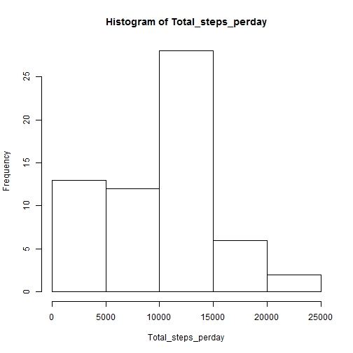
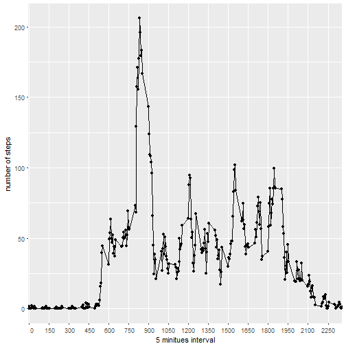
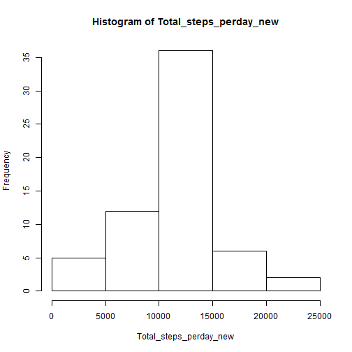
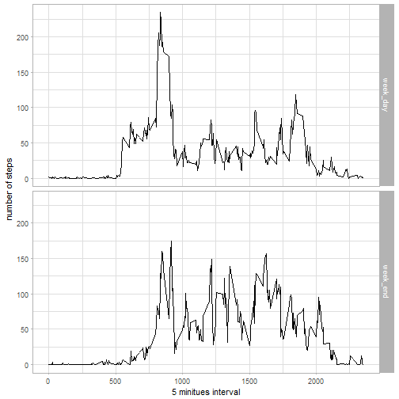

# 1.Loading and preprocessing the data.
The below mentioed code is used to load the data in to an object.

<pre class="knitr r">act &lt;- read.csv(&quot;C:/Users/premsanth/Desktop/Data science coursera/R_programming/repdata_data_activity/activity.csv&quot;)
library(lubridate)
act$date &lt;- ymd(act$date) ##This line transform the data type of the date field.
</pre>

# 2.What is mean total number of steps taken per day?

<pre class="knitr r">library(dplyr)
Total_steps_perday &lt;- tapply(X=act$steps,INDEX = act$date,FUN=sum,na.rm=TRUE)
Total_steps_perday_mat&lt;- data.frame(Date = rownames(Total_steps_perday),Total_steps_perday,row.names=NULL) # To convert the array in to dataframe.
</pre>

### The sample of total number of steps taken per day is (only head of the table is printed below)

<pre class="knitr r">print(head(Total_steps_perday_mat))
</pre>

<pre class="knitr r">##         Date Total_steps_perday
## 1 2012-10-01                  0
## 2 2012-10-02                126
## 3 2012-10-03              11352
## 4 2012-10-04              12116
## 5 2012-10-05              13294
## 6 2012-10-06              15420
</pre>

### A histogram of the total number of steps taken each day

<pre class="knitr r">hist(Total_steps_perday)
</pre>

### The mean and median of the total number of steps taken per day.

<pre class="knitr r">(summary(Total_steps_perday))[c(&quot;Mean&quot;,&quot;Median&quot;)]
</pre>

<pre class="knitr r">##     Mean   Median 
##  9354.23 10395.00
</pre>

# 3.The average daily activity pattern.
### Time series plot of the 5-minute interval (x-axis) and the average number of steps taken, averaged across all days.

<pre class="knitr r">library(ggplot2)
library(reshape2)
Average_steps_Interval &lt;- tapply(X=act$steps,INDEX = act$interval,FUN=mean,na.rm=TRUE)
ggplot(melt(Average_steps_Interval),aes(Var1,value))+geom_line()+geom_point()+scale_x_discrete(limits=seq(0,2355,by=150))+labs(x= &quot;5 minitues interval&quot;,y=&quot;number of steps&quot;)
</pre>

#### 5-minute interval contains the maximum number of steps

The 5-minute interval contains the maximum number of steps is <code class="knitr inline">835</code>

# 4.Imputing missing values.
Total number of missing values in the dataset is `length(which(!complete.cases(act)))`
### Filling in all of the missing values in the dataset.
The code for Filling in all of the missing values in the dataset.

<pre class="knitr r">imput_act &lt;- act
imput_act[which(is.na(imput_act$steps)),&quot;steps&quot;] &lt;- as.vector(Average_steps_Interval[(as.character(imput_act[which(is.na(imput_act$steps)),&quot;interval&quot;]))])
</pre>

The head of new dataset that is equal to the original dataset but with the missing data filled in is

<pre class="knitr r">head(imput_act)
</pre>

<pre class="knitr r">##       steps       date interval
## 1 1.7169811 2012-10-01        0
## 2 0.3396226 2012-10-01        5
## 3 0.1320755 2012-10-01       10
## 4 0.1509434 2012-10-01       15
## 5 0.0754717 2012-10-01       20
## 6 2.0943396 2012-10-01       25
</pre>

## For the new dataset.

### total daily number of steps

<pre class="knitr r">Total_steps_perday_new &lt;- tapply(X=imput_act$steps,INDEX = imput_act$date,FUN=sum,na.rm=TRUE)
</pre>

### Mean and median

<pre class="knitr r">(summary(Total_steps_perday_new))[c(&quot;Mean&quot;,&quot;Median&quot;)]
</pre>

<pre class="knitr r">##     Mean   Median 
## 10766.19 10766.19
</pre>

### histogram

<pre class="knitr r">hist(Total_steps_perday_new)
</pre>

# Activity patterns between weekdays and weekends.
### The code for creating a new factor variable in the dataset.

<pre class="knitr r">imput_act$days &lt;- factor(wday(imput_act$date))
levels(imput_act$days) &lt;- list(week_day=c(&quot;2&quot;,&quot;3&quot;,&quot;4&quot;,&quot;5&quot;,&quot;6&quot;), week_end=c(&quot;1&quot;,&quot;7&quot;))
Average_steps_Interval_weekday &lt;- tapply(X=act$steps,INDEX = list(imput_act$days,imput_act$interval),FUN=mean,na.rm=TRUE)
</pre>

## plot containing a time series plot for weekday and week end.

<pre class="knitr r">ggplot(melt(Average_steps_Interval_weekday),aes(x=Var2,y=value))+facet_grid(Var1~.)+geom_line()+theme_light()+labs(x= &quot;5 minitues interval&quot;,y=&quot;number of steps&quot;)
</pre>

# End of the document.

